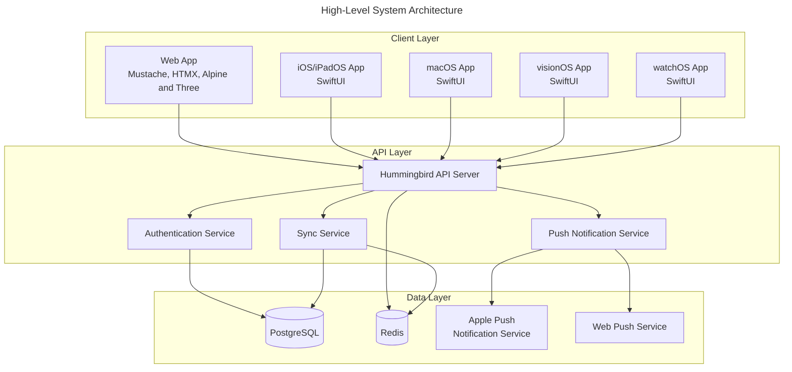
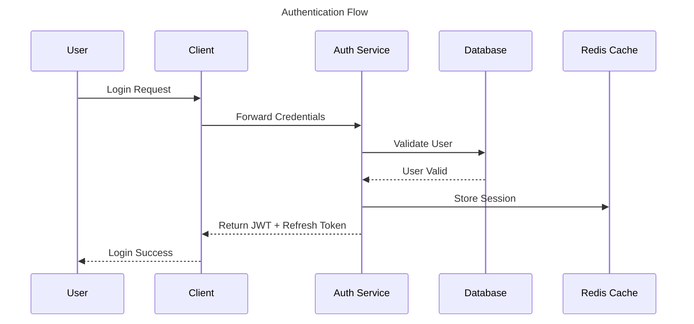
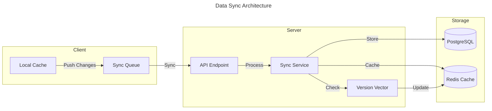
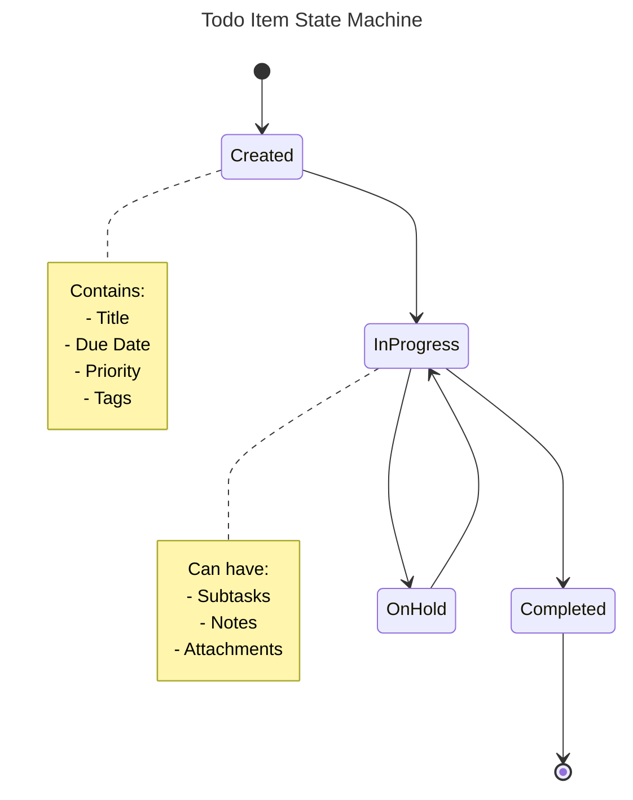

```mermaid
erDiagram
    User ||--o{ TodoList : "owns"
    User {
        uuid id
        string email
        string hashedPassword
        string name
        bool emailVerified
        bool twoFactorEnabled
        jsonb preferences
        timestamp createdAt
        timestamp updatedAt
    }
    
    TodoList ||--o{ Todo : "contains"
    TodoList {
        uuid id
        uuid userId
        string name
        string color
        bool isDefault
        timestamp createdAt
        timestamp updatedAt
    }
    
    Todo ||--o{ SubTask : "has"
    Todo ||--o{ Tag : "tagged_with"
    Todo {
        uuid id
        uuid listId
        string title
        text notes
        datetime dueDate
        enum priority
        bool completed
        enum repeatType
        jsonb repeatConfig
        version syncVersion
        timestamp createdAt
        timestamp updatedAt
    }
    
    SubTask {
        uuid id
        uuid todoId
        string title
        bool completed
        int order
        timestamp createdAt
        timestamp updatedAt
    }
    
    Tag {
        uuid id
        string name
        string color
        timestamp createdAt
        timestamp updatedAt
    }

    Session {
        uuid id
        uuid userId
        string token
        timestamp expiresAt
        timestamp createdAt
    }
  ```
